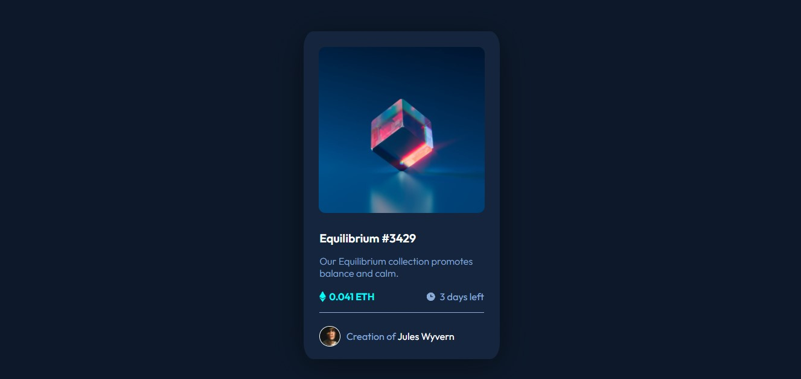

# Frontend Mentor - NFT preview card component solution

This is a solution to the [NFT preview card component challenge on Frontend Mentor](https://www.frontendmentor.io/challenges/nft-preview-card-component-SbdUL_w0U). Frontend Mentor challenges help you improve your coding skills by building realistic projects. 

- [Overview](#overview)
    - [The challenge](#the-challenge)
    - [Screenshot](#screenshot)
    - [Links](#links)
- [My process](#my-process)
    - [Built with](#built-with)
    - [What I learned](#what-i-learned)
    - [Useful resources](#useful-resources)
- [Acknowledgments](#acknowledgments)

## Overview 👀

### The challenge

Users should be able to:

- View the optimal layout depending on their device's screen size
- See hover states for interactive elements

### Screenshot 📸

### Links

- Solution URL: [Add solution URL here](https://your-solution-url.com)
- Live Site URL: [Add live site URL here](https://your-live-site-url.com)

## My process 🔎

### Built with

- HTML
- CSS
- Flexbox
- Mobile-first workflow

### What I learned

As I worked on the challenge I've learned a lot about flexbox, although I didn't use, it led me to do some research about media query. I was able to improve things I've wanted to change from the first challenge — like how the font would break at some points.

### Useful resources

- [W3Schools](https://www.w3schools.com/) - I've learned a lot just by reading their content while applying them on the go.

## Acknowledgments 📢

As always, special thanks to my girlfriend who I woke in the middle of the night to ask questions. And my cats.

